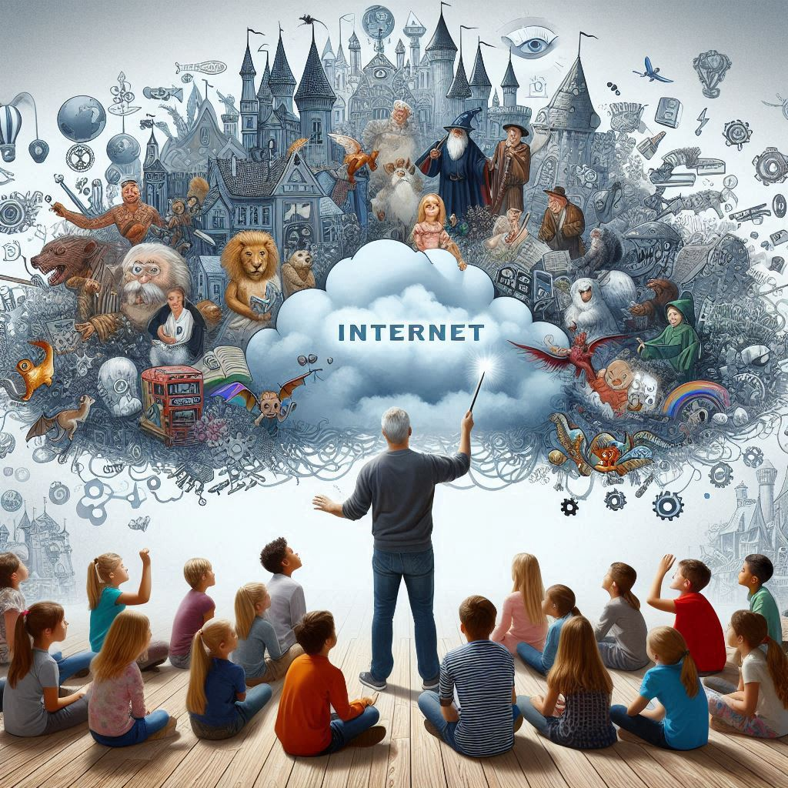

# The Magic of Cloud: How the Internet Works

## Abstract
Have you ever wondered how the internet works? In this fun and interactive session, kids will explore the magic of cloud computing and learn how data travels across the internet. Through engaging activities and simple analogies, we’ll uncover the secrets behind how websites, apps, and games are stored and accessed from anywhere in the world. Kids will participate in hands-on experiments demonstrating how data moves through the cloud, making complex concepts easy to understand and exciting to discover. By the end of the session, kids will have a basic understanding of cloud technology and how it powers the digital world they love.

## Short Abstract
Discover how data travels across the internet in this fun, interactive session for kids. Through activities and analogies, we’ll explain how websites, apps, and games are stored and accessed globally. Hands-on experiments make complex concepts easy and exciting to understand.

## Elevator Pitch
Discover the magic of cloud computing! Kids 10-14 will learn how the internet works through fun activities & hands-on experiments.

# Type
- 60-minute kids session (10-14 age range)

## Tags
- Cloud Computing
- Internet
- Technology
- Interactive Learning
- Fun with Tech

## Learning Objectives
- Add Learning Objectives here

## Additional Notes
- THis session will include hands-on activites to uillustrate how data moves through the Internet.
- NO prior knowledge of technology is required.
- All materials used are safe and non-toxic.
- Parents and guardians are encouraged to participate alongside their children to enhance the learning experience.

## Presentations

| Event | Location | Date | Time | Room | Downloads |
|-------|:--------:|-----:|-----:|-----:|----------:|
| This presentation has yet to be scheduled. | | | | | |

Email [chadgreen@chadgreen.com](mailto:chadgreen@chadgreen.com?subject=Presentation%20Request:%20The%20Magic%20of%20Cloud) to have Chad present this session at your event.

## Resources
There are no additional resources for this presentation.
